### (April 2024) Since the release of Early Access, I decided to discontinue this project since the game now features an official discord rich presence that has the same functionality, and some more. I will keep this repo up in case there's need of this in the future (maybe for modding).

# Rotwood Discord RPC Mod
A sort of proof-of-concept mod for [Rotwood](https://store.steampowered.com/app/2015270/Rotwood/) to show game stats live on your Discord profile (currently unfinished).

## Have a look at it

### 2024 Demo (UPDATED)

In menus

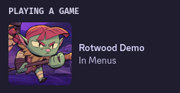

At base camp 

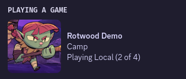

Local singleplayer

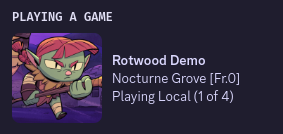

Online

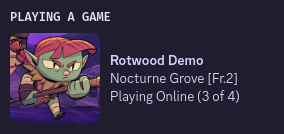

Large image text (can be disabled)

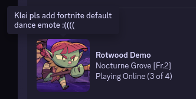

Player count can also be disabled

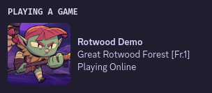

### Playtest 3 (old images)

In menus

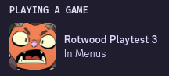

At base camp 

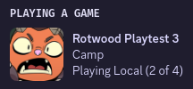

Local singleplayer

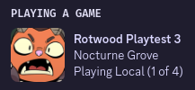

Online


Large image text (can be disabled)

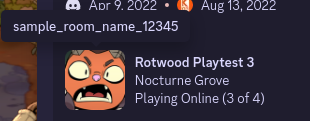

Player count can also be disabled

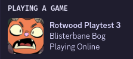

# Installation
## The Mod

**Please keep in mind that this is not a usable mod, nor is it written in a valid mod format for this game. Because there's no mod loader in Rotwood yet, but also because this is my first time writing mods for Klei games so I have no experience. I will try to make this a complete mod in the future though.**

You can run the `rpc.lua` game script in Rotwood but only half of it works, Rotwood still doesn't have a REST client and cannot send/receive http requests.

### Usage
To have Rotwood load a custom script (The exact steps might change throughout different versions but this is the general method):
1. Extract the `data_script.zip` file in the game directory, there should be a new `scripts` folder.
2. Rename `data_script.zip` to something like `data_script.zip.backup` so you have something to restore back later when you don't want to run the game without any modifications (Rotwood also loads the zip file by default and you have to rename it to something else so it's forced to read the `data/` directory anyway)
3. Copy `scripts/` into `data/`. Rotwood will now load the scripts inside `data/scripts/` instead.
4. To organize custom scripts, you should make a new direcotry in `data/scripts/`, e.g: `custom/`.
5. Copy `rpc.lua` into the custom scripts folder you just made.
6. Edit `data/scripts/main.lua` and find a line that says:
    ```lua
    DEV_MODE = RELEASE_CHANNEL == "dev" or IS_QA_BUILD -- For now, QA gets debug tools everywhere.
    ```
    Change it to:
    ```lua
    DEV_MODE = 1
    ```
7. Start Rotwood, dev tools are now enabled, you can activate cheats and all that cool stuff.
8. Press Shift+\` to open the game console.
9. Enter the command `LoadScript("path")` where `path` is the path to that `rpc.lua` script file earlier, relative to `data/scripts/`, e.g: `custom/rpc.lua`. If nothing shows up after executing that command, it means the game loaded that script file and now you can call functions and variables within it.
10. Try running `GetDiscordRPCData()` in the console, if some json data is printed, it's working.

That's about all you can do with it for now, I will definitely complete it when networking features arrive.

## RPC Server Script
This is required to communicate with Discord Rich Presence server because you can't do that with the game's built in functionalities. (Klei doesn't allow you to import libraries with mods for security reasons).

The client (mod) will send game stats like current gamemode and biome name to the RPC server via http API requests, then the server will use that data to interface with Discord's Rich Presence API.

**Both the client and server are run locally on your machine and this connection is not exposed to the internet.**

### Dependencies
- [python](https://www.python.org/)
- [pypresence](https://pypi.org/project/pypresence/): for discord rich presence interface.
- [flask](https://flask.palletsprojects.com/en/3.0.x/): for rest api server handling.
- [waitress](https://pypi.org/project/waitress/): to run the server.

These can be installed through python pip, [using a pip virtual environment is recommended](https://packaging.python.org/en/latest/guides/installing-using-pip-and-virtual-environments/).

Install the 3 required modules for the server script to work:

```shell
pip install pypresence flask waitress
```

### Use your own rich presence app (optimal)

By default the script uses a discord application that I created and manage for the game title and icon, it's updated to match the latest game version

If you would like to use your own application for the rich presence status, create a new app on Discord's developer portal page, give it a name, add assets for the rich presence then change the appID variable and the large_image key in the server script accordingly.

### Usage

Just run the server script:

```py
python rpc-server.py
```

It should hook into your Discord client and start waiting for update requests at `http://0.0.0.0:1974/api/rotwoodrpc`.

### Update Request

To send an update request to the RPC server, a POST request with a json body needs to be sent to `http://0.0.0.0:1974/api/rotwoodrpc`

This is an example json request containing all keys (some are not even needed but have been included for demonstration purposes):

```json
{
    "ingame" : true,
    "localgame" : false,
    "largeimagetext" : "Rotwood Discord RPC Prototype (GH: zgibberish/rotwood-discord-rpc)",
    "primarytext" : "Nocturne Grove [Fr.1]",
    "playercount" : 3,
    "rpcclear" : false
}
```

This provides the following result:

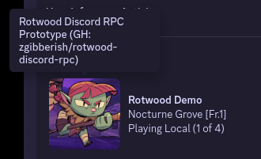

These are the available keys along with their expected values:

Ones marked with * are optimal, ones marked with ^ are ignored if `ingame` is `false`.

- `ingame` (Boolean): Whether you're in-game or not, a value of `false` means the player is currently in the game's main menu.
- ^`localgame` (Boolean): Whether you're playing a local game or not, a value of `true` will make the status displays "Playhing Local", otherwise shows "Playing Online".
- *`largeimagetext` (String): The text to show when the large image is hovered.
- ^`primarytext` (String): Text to show on the first line (by default is beautified biome name + frenzy level).
- ^`playercount` (Positive integer): Number of players in the current game, if provided and not `0` will be displayed in the following format: `(x of 4)`.
- *`rpcclear` (Boolean): If set to `true` will cause all other keys to be ignored and tell the server to clear your rich presence status.

Heres some more examples:

Show "In Menu":
```json
{
    "ingame" : false
}
```
Show playing local singleplayer, in Nocturne Grove biome and frenzy level 0:

```json
{
    "ingame" : true,
    "localgame" : true,
    "primarytext" : "Nocturne Grove [Fr.0]",
    "playercount" : 1
}
```

Clear the status:
```json
{
    "rpcclear" : true
}
```

Python example (requires the `requests` module):

```py
import requests

# Shows "In Menus"
payload = {
    "ingame" : False
}

r = requests.post("http://0.0.0.0:1974/api/rotwoodrpc", json=payload)
print(r.status_code)
```

### GET Request

You can also fetch the same set of data back from the server at `http://0.0.0.0:1974/api/rotwoodrpc` for whatever purpose you want.

This is an example Python script to get that data from the RPC server (requires the `requests` module):

```py
from pprint import pprint
import requests

r = requests.get("http://0.0.0.0:1974/api/rotwoodrpc")
pprint(r.json())
```

### Changing The Server Port

The default port that the RPC server listens to is `1974`, if you want to use a different port for both the server and the client:

- For the server, change `rpc_server_port` in `rpc-server.py`
- For the game script, change `rpc_server_port` in `rpc.lua`

And use your new port instead of `1974` whenver you want to send requests to the server.

# Future Development And Bugs

I plan to make it more easily customizable in the future, like adjusting what info goes where on the RPC status, for now you can go through `rpc-server.py` and make changes to your likings, There are some comments that explain how things work. If you know about modding Rotwood or DS(T), you can tweak around to make it show other stats when the game gets modding support, the possibilities are quite endless.

This is my first time writing a REST api server, so it all might not go smoothly, and there's a few quirks in the code. If you do encounter any issues or instabilities, please open an issue and I will gladly look into it. Thank you!
